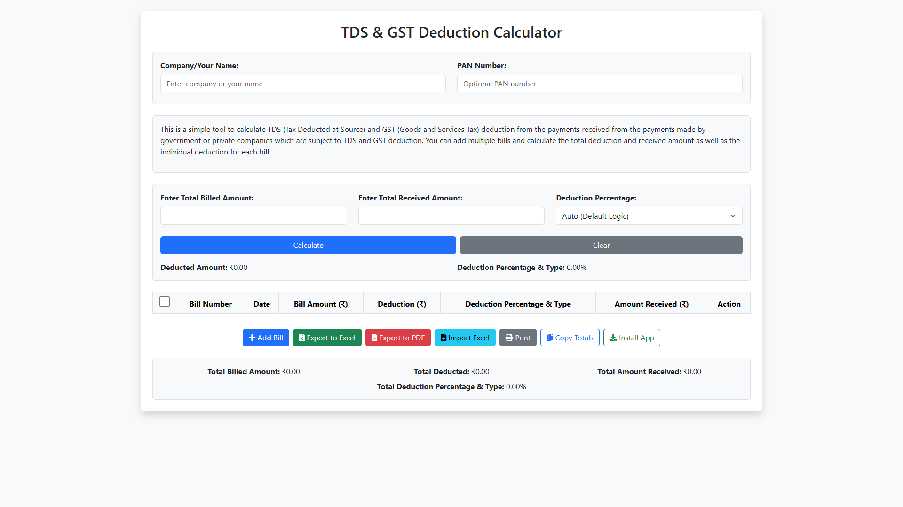
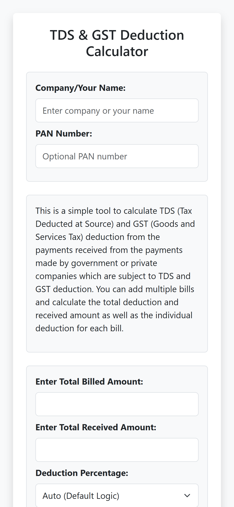

# TDS & GST Deduction Calculator

<div align="center">



**A professional Progressive Web App (PWA) for calculating TDS and GST deductions**

[](https://tds-deduction-calculator.pages.dev/)
[](LICENSE)
[](manifest.json)
[](sw.js)

</div>

---

## 📖 Overview

A professional web-based tool to calculate TDS (Tax Deducted at Source) and GST (Goods and Services Tax) deductions from payments. Perfect for freelancers, contractors, and businesses who need to track deductions from government or private companies.

**🌐 Live Demo:** [tds-deduction-calculator.pages.dev](https://tds-deduction-calculator.pages.dev/)

## ✨ Key Features

### 💰 **Smart Calculation**
- Automatic TDS/GST calculation based on amount (2.24% for ≤₹25K, 4.24% for >₹25K)
- Flexible deduction percentage selector with custom rates (2.24%, 2.40%, 2.43%, 4.24%, or custom)
- Bidirectional calculation (enter billed or received amount)
- Real-time updates across all bills
- **Smart validation** - Prevents exceeding manual totals when set first

### 📊 **Summary Dashboard**
- Total bill count and date range
- Average deduction percentage
- Highest bill amount tracking
- Auto-hides when no data
- Real-time updates

### 📝 **Bill Management**
- Add multiple bills with invoice numbers and dates
- Auto-fill today's date for new bills
- **Bulk selection** with checkboxes
- Individual row actions (delete, clear, copy)
- Bulk delete for selected bills
- Confirmation dialogs to prevent accidental deletions
- Row-level validation against manual totals

### 💾 **Data Persistence & Import/Export**
- **Auto-save** to browser localStorage (works offline)
- Export to Excel with timestamped filenames
- Export to PDF with company header and totals
- Import existing bills from Excel
- Professional print layout (hides checkboxes and action buttons)
- **Properly formatted exports** - Clean data without HTML elements

### 🏢 **Company Information**
- Company/Your Name field
- **GSTN Number** field (15 characters, replaces PAN)
- Appears in PDF reports and prints
- Persisted in localStorage

### 🎨 **User Experience**
- Beautiful toast notifications for all actions (with offline fallback)
- Modern confirmation dialogs with SweetAlert2
- Cross-platform keyboard shortcuts (Ctrl/Cmd)
- Copy totals or individual bills to clipboard
- Mobile-optimized responsive design
- ARIA labels and accessibility features
- **Installable PWA** - Install prompt with benefits showcase

### 📱 **Progressive Web App (PWA)**
- **Fully offline capable** - Works without internet
- **Installable** on desktop and mobile
- **Cache-first strategy** - Instant loading
- All CDN resources pre-cached
- Service worker with smart caching
- Add to home screen on mobile
- Native app-like experience

### ⌨️ **Keyboard Shortcuts**
- **Ctrl/Cmd + N** - Add new bill
- **Ctrl/Cmd + E** - Export to Excel
- **Ctrl/Cmd + S** - Save data locally
- **Enter** - Calculate (when in amount fields)

### 📱 **Mobile Optimized**
- Larger touch targets (44px minimum)
- Responsive table layout
- Smooth touch scrolling
- Highlight active rows
- Works on all screen sizes

## 🖼️ Screenshots

<div align="center">

### Desktop View


### Mobile View


### Tablet View


</div>

## 🛠️ Technologies Used

- **Frontend**: HTML5, CSS3, JavaScript (ES6+)
- **Framework**: Bootstrap 5.3.8
- **Icons**: Font Awesome 7.0.1
- **Libraries**: 
  - XLSX.js 0.18.5 (Excel export/import)
  - jsPDF 3.0.3 + autoTable 5.0.2 (PDF generation)
  - Toastr 2.1.4 (toast notifications)
  - SweetAlert2 11.23.0 (beautiful confirmation dialogs)
  - jQuery 3.7.1 (for library support)
- **Storage**: LocalStorage API (offline capability)
- **CDN**: Cloudflare CDN (optimized for Cloudflare Pages)
- **PWA**: Service Worker with cache-first strategy

## 🚀 How to Use

### Basic Calculation
1. **Enter Company/Your Name** (optional) - Appears in exports and prints
2. **Enter GSTN Number** (optional, 15 digits) - Included in PDF reports
3. **Select Deduction Percentage** - Choose from preset rates or enter custom
4. **Enter Amount** - Input either billed or received amount
5. **Click Calculate** - Or press Enter to compute

### Managing Bills

#### Method 1: Manual Totals First
1. Enter **Total Billed Amount** and **Total Received Amount** at the top
2. Click **Calculate** to set the totals
3. Add bills - The system will **prevent exceeding** the set totals
4. **Automatic validation** ensures bills don't exceed limits

#### Method 2: Bills First (Flexible)
1. Click **"+ Add Bill"** or press Ctrl/Cmd+N
2. Enter **Bill Details** - Number, date (auto-filled), and amount
3. **Auto-Calculate** - Deductions calculate automatically
4. Add as many bills as needed (no restrictions)
5. Totals update automatically

### Bulk Operations
1. **Select Bills** - Use checkboxes to select multiple bills
2. **Delete Selected** - Button appears when bills are selected
3. **Select All** - Use header checkbox to select/deselect all

### Import Existing Data
1. **Prepare Excel File** - Required columns: "Bill Number", "Date", "Bill Amount (₹)", "Amount Received (₹)"
2. Click **"Import Excel"** button
3. **Select File** - Bills are automatically imported and calculated
4. Data validates and imports seamlessly

### Export Options
- **Excel**: Clean spreadsheet with proper data formatting, no HTML elements
- **PDF**: Professional report with company header, GSTN, and totals
- **Print**: Clean layout without checkboxes, buttons, or action columns
- **Copy**: Quick copy of totals to clipboard

### Install as PWA
1. **Desktop**: Click the install button in address bar or use the "Install App" button
2. **Mobile**: Tap "Add to Home Screen" when prompted
3. **Benefits**:
   - Works completely offline
   - Faster loading (cache-first)
   - No browser UI
   - Desktop/home screen icon
   - Native app experience

## 💻 Local Development

To run this project locally:

1. **Clone the repository:**
   ```sh
   git clone https://github.com/SubhanRaj/TDS-Deduction-Calculator.git
   ```
2. **Open the project folder:**
   ```sh
   cd TDS-Deduction-Calculator
   ```

3. **Open in browser:**
   - Simply open `index.html` in your browser
   - No build process required!
   - Works immediately

4. **Test PWA features:**
   - Use a local server for full PWA functionality:
   ```sh
   # Using Python
   python -m http.server 8000
   
   # Or using Node.js
   npx http-server
   ```
   - Visit `http://localhost:8000`
   - Test offline mode by disabling network in DevTools

### 🔧 Project Structure

```
TDS-Deduction-Calculator/
├── index.html           # Main HTML file
├── script.js            # Core JavaScript logic
├── style.css            # Custom styles
├── sw.js                # Service Worker (PWA)
├── manifest.json        # PWA manifest
├── LICENSE              # MIT License
├── README.md            # Documentation
├── robots.txt           # SEO
├── sitemap.xml          # SEO
├── browserconfig.xml    # Windows tiles
├── schema.json          # Structured data
└── assets/
    ├── icons/           # PWA icons (Android, iOS, Windows)
    ├── screenshots/     # App screenshots
    ├── logo.svg         # Vector logo
    ├── logo.png         # PNG logo
    └── logo.webp        # WebP logo
```

## 🎯 Use Cases

- **Freelancers**: Track TDS deductions from client payments
- **Contractors**: Manage government contract deductions  
- **Small Businesses**: Calculate GST and TDS for multiple invoices
- **Accountants**: Quick deduction calculations for clients
- **Invoice Management**: Keep records with export capabilities
- **Offline Work**: Calculate anywhere without internet

## 🌐 Browser Compatibility

- ✅ Chrome/Edge (latest) - Full support
- ✅ Firefox (latest) - Full support
- ✅ Safari (latest) - Full support
- ✅ Mobile browsers (iOS Safari, Chrome Mobile) - Full support
- ✅ PWA Install - All modern browsers

## 🚀 Deployment

This project is deployed on **Cloudflare Pages** for optimal performance:

- **Instant loading** with edge caching
- **Global CDN** for worldwide access
- **Automatic HTTPS** 
- **Zero configuration** deployment
- **Git integration** for continuous deployment

To deploy your own instance:
1. Fork this repository
2. Connect to Cloudflare Pages
3. Deploy with default settings (no build command needed)
4. Your app is live!

## 🔐 Privacy & Data

- **100% Client-Side**: All calculations happen in your browser
- **No Server**: No data sent to any server
- **LocalStorage Only**: Data saved locally on your device
- **Privacy First**: Your financial data never leaves your device
- **No Tracking**: No analytics or tracking scripts
- **Open Source**: Review all code on GitHub

## 🐛 Bug Fixes & Improvements

### Latest Updates
- ✅ Fixed localStorage not saving table data (checkbox column offset)
- ✅ Fixed clear button not clearing company name and GSTN
- ✅ Added smart validation to prevent exceeding manual totals
- ✅ Fixed print layout to hide checkboxes and action columns
- ✅ Fixed Excel export showing HTML/icons instead of clean data
- ✅ Fixed PDF export with proper column formatting
- ✅ Implemented cache-first PWA strategy for instant offline loading
- ✅ Added all CDN resources to service worker cache
- ✅ Changed PAN to GSTN with proper 15-character limit
- ✅ Added bulk selection and delete functionality

## 🤝 Contributing

Contributions are welcome! Please feel free to submit a Pull Request. For major changes:

1. Fork the repository
2. Create your feature branch (`git checkout -b feature/AmazingFeature`)
3. Commit your changes (`git commit -m 'Add some AmazingFeature'`)
4. Push to the branch (`git push origin feature/AmazingFeature`)
5. Open a Pull Request

## 📝 License

This project is licensed under the MIT License. See the [LICENSE](LICENSE) file for more information.

## 👨‍💻 Author

**Subhan Raj**
- GitHub: [@SubhanRaj](https://github.com/SubhanRaj)
- Website: [tds-deduction-calculator.pages.dev](https://tds-deduction-calculator.pages.dev)

## ⭐ Show Your Support

If this project helped you, please give it a ⭐️!

---

<div align="center">

**Made with ❤️ by [Subhan Raj](https://github.com/SubhanRaj)**

[Report Bug](https://github.com/SubhanRaj/TDS-Deduction-Calculator/issues) · [Request Feature](https://github.com/SubhanRaj/TDS-Deduction-Calculator/issues)

</div>
   ```sh
   cd TDS-Deduction-Calculator
   ```
3. Open `index.html` in your browser - No build process required!

### Offline Capability
Works 100% offline once loaded. All CDN resources have graceful fallbacks.

## 🎯 Use Cases

- **Freelancers**: Track TDS deductions from client payments
- **Contractors**: Manage government contract deductions
- **Small Businesses**: Calculate GST and TDS for multiple invoices
- **Accountants**: Quick deduction calculations for clients
- **Invoice Management**: Keep records with export capabilities

## 🌐 Browser Compatibility

- ✅ Chrome/Edge (latest)
- ✅ Firefox (latest)
- ✅ Safari (latest)
- ✅ Mobile browsers (iOS Safari, Chrome Mobile)

## 📝 License
This project is licensed under the MIT License. See the [LICENSE](license) file for more information.
